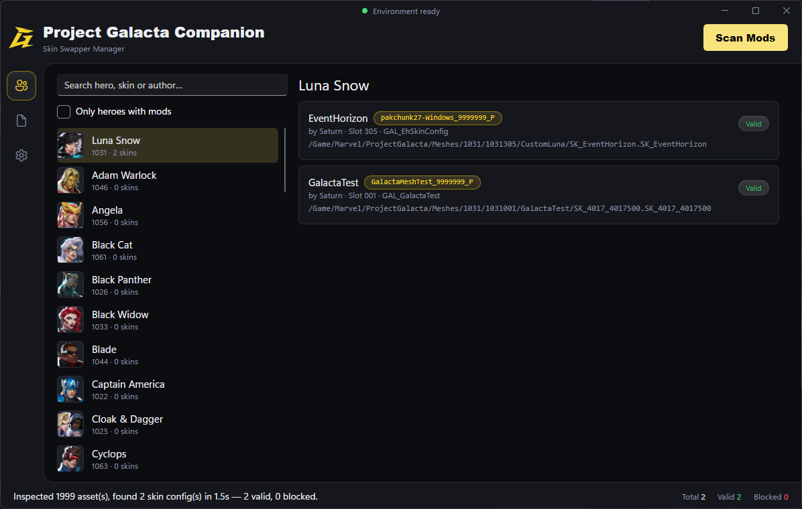

## What it's for

The Galacta Companion App scans your installed mods and builds the manifest that the [Skin Swapper](../skin-swapping/) reads in-game to know which mod replaces which skin.

## Setup

The only thing you need to configure is your game's install folder. The Paks folder, mods folder, and manifest output path are all derived from that automatically. Edit them only when needed.

## Scanning your mods

- The app scans automatically on launch, once it locates the game – you don't need to press Scan Mods yourself in normal use.
- A scan cache keeps re-scans fast: only new or changed mod containers get re-read, everything else is reused from the last scan.
- If a scan seems stuck or stale after updating a mod, use the **Clear scan cache** button from the settings.

## The Manifest tab

| Tab | Shows |
| :--- | :--- |
| **Preview** | What the next write would produce, from the last scan. |
| **Live skins.txt** | What's actually written to disk right now. |

Use Preview to check your mods look right before writing, and Live to confirm what's actually installed and being read by the game. If the two don't match, you've scanned but haven't written the manifest yet.

## Environment status

A status light in the header shows whether your install is ready to run Project Galacta and use the Skin Swapper:

| Status | Meaning |
| :--- | :--- |
| Red | Game not found, or Project Galacta isn't installed. |
| Amber | Incomplete – either the mod isn't installed, or the manifest is missing. |
| Green | Ready. |

## Troubleshooting

- Mod data reading back blank usually means the game's mappings are out of date. The app updates them automatically on launch and after game patches – if you've pinned a custom mapping file yourself, you'll need to update it manually instead.
- The Companion App will flag if a specific mod's manifest entry is invalid, and tell you what's wrong with it.

---

##### ⇀ Refer to [Skin Swapping](../skin-swapping/) for using the manifest in-game.
