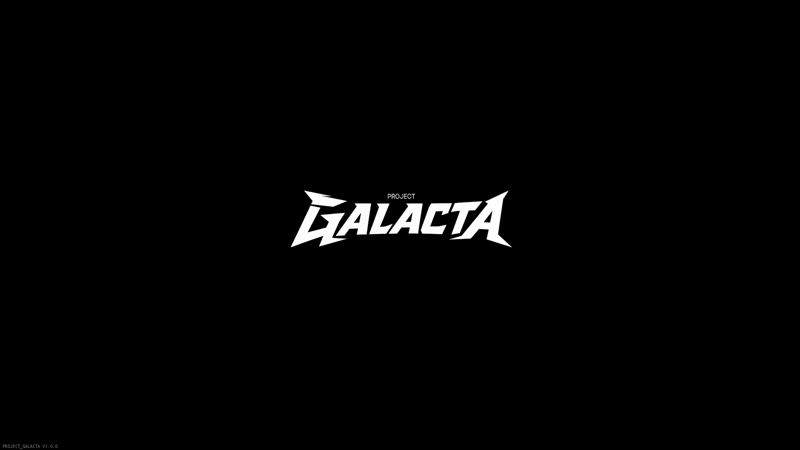
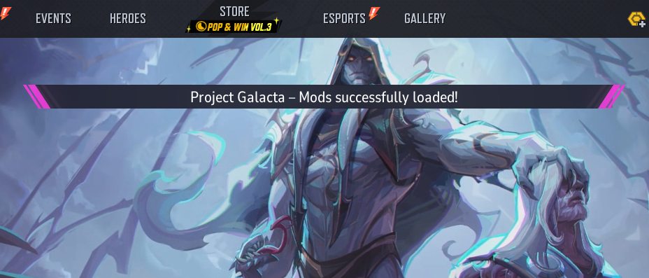

## Requirements

- [Rivals SIG Bypasser](https://www.nexusmods.com/marvelrivals/mods/2940) to load the Project Galacta mod
- For the Companion App: Windows 10/11 and [.NET 8 Desktop Runtime](https://dotnet.microsoft.com/en-us/download/dotnet/8.0)

## Project Galacta Mod Installation

Basic setup for the Mod Loader:

0. Remove other mod unblocking solutions, keep Signature Bypass installed only.
1. Download the latest release from [NexusMods](https://www.nexusmods.com/marvelrivals/mods/12806) or [GitHub Releases](https://github.com/0xSaturno/ProjectGalacta/releases).
2. Extract the mod container (`.pak, .ucas, .utoc`) into your game's **Paks** folder.
>  _It is recommended to place it under `/Paks` for better stability._
3. Launch the game and log in. Mods will be mounted after login.

## Verifying it works

- Project Galacta will show its title logo after intro movies. If you see that, mod is working.

- After logging in, a popup message will confirm the successful mod mounting.

---

##### ⇀ Refer to [Skin Swapping](../skin-swapping/) for Skin Swapper setup.