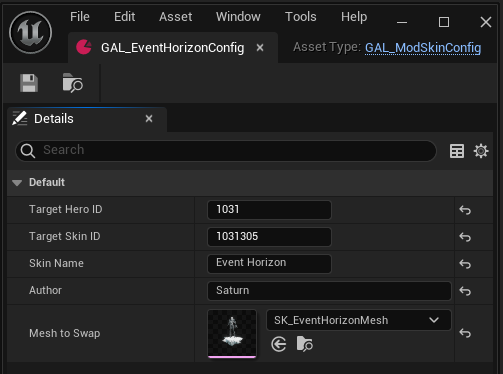

## Overview

The Skin Swapper lets you replace a character's equipped skin mesh with other mesh mods that are compatible with Project Galacta.

## How it works

Project Galacta adds its own in-game overlay, the **Skin Swapper** menu, opened with **P**. Its **Skins** tab lists the installed mod skins available for your currently equipped skin – not the hero's own vanilla skins, which you still pick through the game's normal skin selection first. A **Default** entry is always listed too, to revert back to the vanilla mesh.

>  `P` _is also the game's default voice chat menu bind. It's recommended to unbind or move that first to avoid a conflict – or just rebind the Skin Swapper key instead, see below._

For a mod to show up there, it has to ship a **Skin Config** asset – that's what the Companion App scans for when it builds the manifest from your installed mod packages. Mods without one won't be picked up.

### Rebinding the menu key

The Skin Swapper's menu key can be rebound from the game's own settings, in: **Settings → Others tab → Project Galacta section**.

## Swapping a skin

1. Install a skin mod that ships a Skin Config asset (compatible with Project Galacta) into your mods folder.
2. Open the Companion App, setup settings and build the manifest.
3. In-game, select the hero skin the mod is for, then press **P** to open the Skin Swapper overlay.
4. Pick the mod skin from the **Skins** tab, it applies immediately.

## Other tabs

- **Morphs** – tweak the shape keys shipped with the currently swapped mesh using sliders.
- **Materials** – show or hide each material slot on the currently swapped mesh.
- **Accessories** and **Settings** – coming soon.

## Supported characters / skins

Any skin already unlocked on your account can be modded – including each hero's free default costume. The swap is based on whichever skin is currently equipped, not a fixed compatibility list, so there's nothing to look up per character.

## Integrity concerns

- Mesh Swapper runs robust security checks. It does **not** let you preview or unlock skins you haven't purchased. The swap only replaces the mesh of a skin you already own and have equipped – it can't point at a vanilla premium skin you don't own, that's explicitly blocked.

## For modders

To make a skin mod Project Galacta-compatible, it needs a **`GAL_ModSkinConfig`** DataAsset alongside your mesh, that's what the Companion App reads to build the manifest.
Start from the SkinConfig template (downloadable from both [NexusMods](https://www.nexusmods.com/marvelrivals/mods/12806) and [GitHub Releases](https://github.com/0xSaturno/ProjectGalacta/releases)); direct instances of the template are required, subclassing isn't supported.

>  _Already have a "regular" mesh mod pointing at `/Content/Marvel/Characters/...`?_ 
> _That same mesh can't be reused as-is. Copy your custom mesh into the Project Galacta folder like explain below and continue with the guide. You can keep shipping the original as a regular replacer for players not using the Skin Swapper, and ship the moved copy as a separate PG-compatible version._

Package your custom mesh only – don't include an override for the vanilla mesh path in the same mod. Otherwise reverting to **Default** in the Skin Swapper still shows your custom mesh instead of the actual vanilla one.

The same goes for materials. If your custom mesh's material instances still live inside the vanilla skin's own folder (instead of being duplicated into your own mod folder first), packaging your mod overrides that vanilla material path too – so even **Default** ends up rendering with your custom material, since the vanilla mesh points at that same, now-overridden path. Always duplicate materials into your own folder before editing them.

###### The steps to follow to make a Skin Swapper-compatible mesh mod:

0. Import the `GAL_ModSkinConfig` uasset in your UE project and place it under `/Content/Marvel/ProjectGalacta/Blueprints`, open it and compile the blueprint.
1. Create an instance of it by creating a new <u>Data Asset</u> of class **GAL_ModSkinConfig**, rename it how you like, and fill in:

   | Property | Type | Value |
   | :--- | :--- | :--- |
   | `TargetHeroID` | Int | 4-Digit Hero ID |
   | `TargetSkinID` | Int | Full 7-digit skin ID |
   | `SkinName` | Str | Name of your custom skin, shown in the Skin Swapper's Skins tab |
   | `Author` | Str | Shown alongside the skin name |
   | `MeshToSwap` | Object | Skeletal Mesh Reference to your replacement mesh |

2. Place both the config instance and the mesh it points to in the same folder:
   `/Content/Marvel/ProjectGalacta/Meshes/{HeroID}/{SkinID}/{YourModFolder}/`
> _All the materials, textures, anim blueprints, other assets referenced by the mesh can stay outside of `YourModFolder`. You can name your custom mesh however you like. Please, keep mod structure organized._
3. Add your Skin Config Data Asset (with the other mod assets) to your project's PrimaryAssetLabel and package the mod as usual.

 `MeshToSwap` must point at your own custom mesh, it can't reference a vanilla game asset directly, that's blocked.

###### Example of a correct Skin Config:

### Common validation errors

The Companion App cross-checks the declared IDs, the config asset's own path, and the mesh's path – all three must agree, or the mod is rejected with one of:

- **Hero/Skin ID mismatch** – the ID(s) in the config don't match the `{HeroID}/{SkinID}` folder it's sitting in.
- **Mesh folder mismatch** – the mesh isn't in the same mod folder as its config.
- **Vanilla path blocked** – `MeshToSwap` points at a native game asset instead of your packed mesh.

## Troubleshooting

- If the modded skin doesn't show up, make sure you're equipping the exact skin (hero + skin, not just the hero) the mod was made for.
- If the manifest itself might be the problem, see [Companion App](../companion-app/) troubleshooting.

---

##### ⇀ Refer to [Companion App](../companion-app/) for manifest management.
